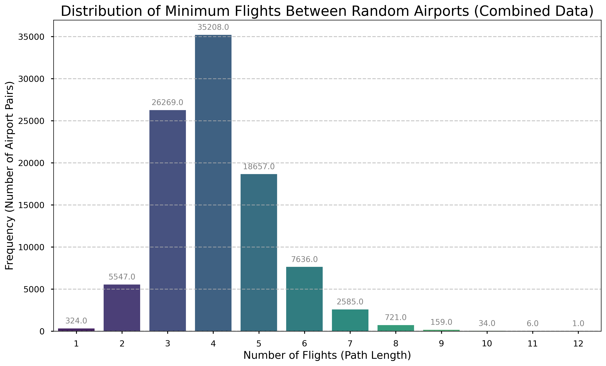
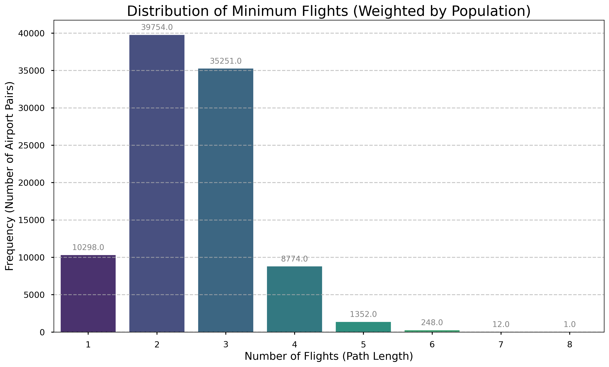

# ✈️ Global Flight Network Analysis

An exploration of the world's air travel network using Python, graph theory, and data analysis. This project investigates the "small-world" phenomenon in air travel, evolving from a simple analysis of connections to a sophisticated, population-weighted simulation of shortest travel distances.

---

## 📖 Project Overview

Inspired by the "six degrees of separation" concept, this project models the global flight network as a graph to determine how interconnected the world truly is. By representing airports as nodes and direct flights as edges, we can use graph algorithms to uncover fascinating insights about global travel.

The analysis progresses through several models of increasing complexity:
1.  **Degrees of Separation:** Finding the average number of flights needed to connect any two random airports.
2.  **Population-Weighted Connections:** Introducing a realistic bias where airports in more populous cities are more likely to be chosen as start or end points.
3.  **Shortest Path Distance:** Calculating the shortest possible travel distance (in km) between airports using a geographically weighted graph and Dijkstra's algorithm.

---

## 🛠️ Models & Methodology

This repository contains the code for four key analyses, each in its own Python script.

### 1. Basic Degrees of Separation
* **Goal:** Find the average number of flights between two randomly selected airports.
* **Method:** An **unweighted, undirected graph** is constructed from the flight routes. A Breadth-First Search (BFS), implemented via `networkx.shortest_path_length`, is used to efficiently find the minimum number of connections.
* **Scripts:** `1_basic_degrees_of_separation.py` and `2_unweighted_network_analysis.py`

### 2. Population-Weighted Analysis
* **Goal:** Find the average number of flights, but with a bias towards real-world travel patterns.
* **Method:** The `geonamescache` library is used to get population data for the cities served by each airport. During the simulation, `random.choices` performs a **weighted random sampling**, making airports in major hubs far more likely to be selected.
* **Script:** `3_population_weighted_flights.py`

### 3. Shortest Distance with Population Bias
* **Goal:** Find the average shortest *travel distance* (in km) between two population-weighted random airports.
* **Method:** This is the most comprehensive model.
    * The graph's edges are assigned a **weight** corresponding to the geographical distance between the two airports, calculated using the **Haversine formula**.
    * The simulation uses the same population-weighted sampling as the previous model.
    * **Dijkstra's algorithm** (`networkx.dijkstra_path_length`) is used to find the path that minimizes the total kilometers traveled.
* **Script:** `4_population_weighted_distance_dijkstra.py`

---

## 📈 Results & Visualizations

The output of each analysis is visualized below. These images are generated by the scripts and saved in the `Outputs/` directory.

### 1. Unweighted Flight Distribution


### 2. Population-Weighted Flight Distribution


### 3. Population-Weighted Distance Distribution


---

## 📊 Data Sources
* **Flight & Airport Data:** [OpenFlights.org](https://openflights.org/data.html) - A comprehensive public database of airports, airlines, and flight routes.
* **Population Data:** [`geonamescache`](https://pypi.org/project/geonamescache/) - A Python library that provides an offline, self-contained database of geographical data, including city populations.

---

## 🚀 How to Run

### Local Execution (Windows)
This is the recommended method. The project includes a batch file that automates the entire process.

1.  **Clone the Repository:**
    ```bash
    git clone [https://github.com/paratesai316/Six-Degrees-of-Air-Travel.git](https://github.com/paratesai316/Six-Degrees-of-Air-Travel.git)
    cd Six-Degrees-of-Air-Travel
    ```
2.  **Run the Batch File:**
    Simply double-click the `run_all.bat` file.

    This script will automatically:
    * Install all the required Python libraries (`pandas`, `networkx`, `seaborn`, etc.).
    * Run all four analysis scripts in sequence.
    * Save the resulting plots in the `Outputs` folder.

### Google Colab
The original scripts can also be run in a Google Colab notebook. You would need to copy the code from each `.py` file into a separate cell and run them.

---

## 💡 Key Findings
* The global flight network exhibits strong **small-world properties**, with a surprisingly low number of flights needed to connect most airports.
* When weighting for population, the average number of connections **decreases**, confirming that major hubs make the world feel smaller for the majority of travelers.
* The analysis of shortest travel distances provides a quantitative measure of global connectivity, revealing the average minimum distance required to travel between likely origin and destination points.
